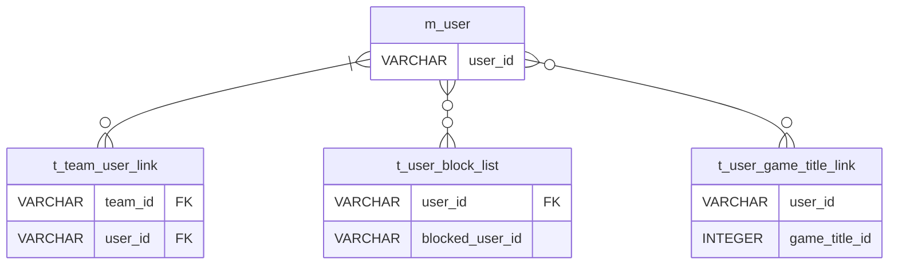

## テーブル名  
m_user
  
## テーブル論理名  
ユーザーマスタ

## カラム一覧  

| no | カラム名 | カラム論理名 | 型 | デフォルト値 | ユニーク | not null | 主キー |
| :----: | :----: | :----: | :----: | :----: | :----: | :----: | :----: |
| 1 | user_id | ユーザーID | VARCHAR |  | ✅ | ✅ | ✅ |
| 2 | cognito_id | cognitoID | VARCHAR |  | ✅ | ✅ |  |
| 3 | user_name | ユーザー名 | VARCHAR | "No Name" |  | ✅ |  |
| 4 | self_introduction | 自己紹介文 | TEXT | "よろしくお願いします。" |  | ✅ |  |
| 5 | ps_id | PSID | VARCHAR |  |  |  |  |
| 6 | xbox_id | XboxID | VARCHAR |  |  |  |  |
| 7 | switch_id | SwitchID | VARCHAR |  |  |  |  |
| 8 | steam_id | SteamID | VARCHAR |  |  |  |  |
| 9 | discord_id | DiscordID | VARCHAR |  |  |  |  |
| 10 | twitter_id | TwitterID | VARCHAR |  |  |  |  |
| 11 | youtube_channel | YoutubeChannel | VARCHAR |  |  |  |  |
| 12 | created_at | 作成日 | DATETIME |  |  |  |  |
| 13 | updated_at | 更新日 | DATETIME |  |  |  |  |
| 14 | is_deleted | 削除済みフラグ | BOOLEAN | FALSE |  | ✅ |  |
  
### カラム備考  
cognito_id: cognito登録時に紐づけられたIDの値をそのまま保持する。  
各種ハードウェアのID: 本人以外のなりすまし登録もあり得るため、一意制約を設けることはしない。  
  

## テーブル相関図  

